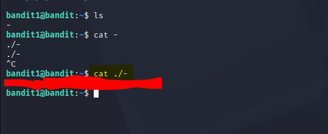
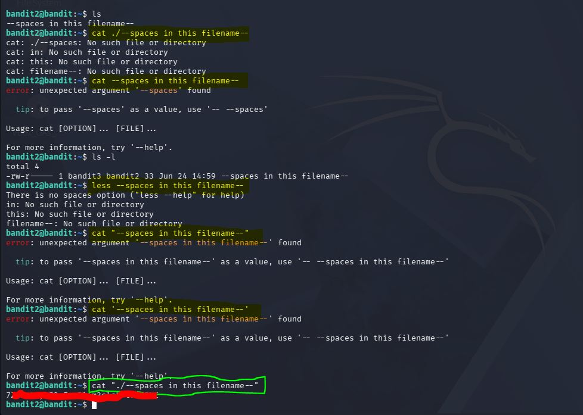
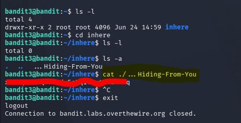
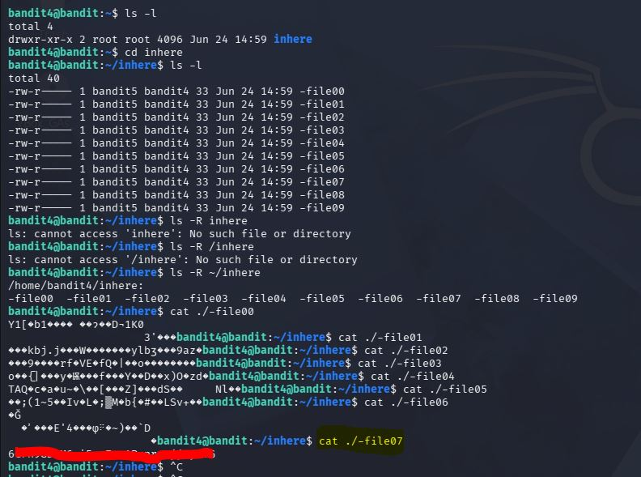
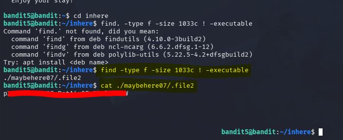
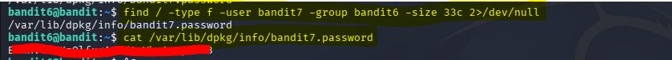
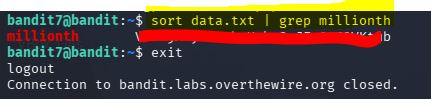
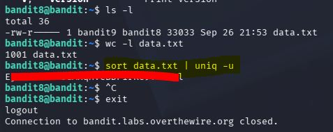
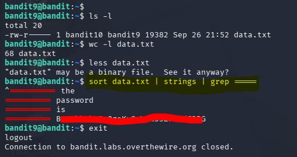
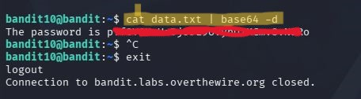

**\# Step by Step of how I retrieved the password for each level from
the file in the previous level.**

**\## On level 0,**

  I logged in to a remote server with already provided login details
using **\*\*\"ssh\"\*\*** as the command that prefix the server url
\"https://overthewire.com\" followed by adding option **\*\*\"-p\"\*\***
to indicate the port. Then I opened a file that contains the password to
Level 1 with the **\*\*\"cat\"\*\*** command.

{width="3.4609930008748906in"
height="1.837211286089239in"}
{width="3.4245352143482064in"
height="1.8177209098862641in"}

{width="3.9210925196850392in"
height="2.085734908136483in"}

**\## On level 1,**

  I opened a file with a special character as the filname (i.e. \"-\")
using the **\*\*\"cat\"\*\*** command. The **\*\*\"cat\"\*\*** command
passed as the STDIN on my first attempt, then I run it again but this
time by adding **\*\*\"./\"\*\***  to the filename which enable me open
the file that contains the password to level 2.

**\## On level 2,**

  I opened a file with spaces in the file name using the
**\*\*\"cat\"\*\*** command by adding qoute **\*\*\"\"\*\*** character
at the beginning and the end of the filename (inclusive of the \"./\"
prefix). Then, I executed it successfully.

**\## On level 3,**

  I changed to a directory using the **\*\*\"cd\"\*\*** command, then
show hidden files with the option **\*\*\"-a\"\*\*** added to the
**\*\*\"ls\"\*\*** command as **\*\*\"ls -a\"\*\*** to view the
password.

**\## On level 4,  **

  I changed to a directory using the **\*\*\"cd\"\*\*** command, then
list the files under the directory tosee the available files. I tried to
use a recursive **\*\*\"-R\"\*\*** option to list the content in the
files from the directory path, however I learnt recursive mode only list
files under a directory and no the content of the files. I accessed the
password in the particular bearing file using the **\*\*\"cat\"\*\***
command to open the files one after another.

**\## Level 5,**

  I used the **\*\*\"find\"\*\*** command added with other option
attributes to find a particular file out of numerous files in the
directory. **\*\*(i.e. find -type f -size 1033c and !
-executable).\*\*** The exact file with the attributes was printed to
the screen and I used **\*\*\"cat\"\*\*** command to view the file.

**\## Level 6,**

  I used the same **\*\*\"find\"\*\*** command in addition with other
option attributes to locate the file under another user account using
the group access permission **\*\*(i.e. find -type f -user bandit7
-group bandit6 -size 33c 2\>/dev/null).\*\*** Then used
**\*\*\"cat\"\*\*** command to view the file displayed as the result.
The **\*\*\"2\>/dev/null\"\*\*** option was used to send error messages
to the /dev/null as **\*\*STDERR.\*\***

**\## Level 7,**

  I used the **\*\*\"sort\"\*\*** command to sort the list of numerous
lines of password and piped it to fiter command **\*\*\"grep\"\*\***
alongside the word \"millionth\".  

**\## Level 8,**

  I used the **\*\*\"sort\"\*\*** command to sort the list of numerous
lines of password and pass it to **\*\*\"uniq -u\"\*\*** command to
filter out duplicated lines.

**\## Level 9,**

  After realizing the file is a binary file with some human-readable
texts, I used the **\*\*\"sort\"\*\*** command to sort the file and
piped it to **\*\*\"strings\"\*\*** command, then passed it to
**\*\*\"grep\"\*\*** command to filter characters **\*\*\"====\"\*\***
which precede the text that contains the password.

**\## Level 10,**

  I used the **\*\*\"cat\"\*\*** command to open the file and piped it
to **\*\*\"base64 -d\"\*\*** to decode the encrypted password.

Levels      Password

  1   6\*\**\*\*\*\*\*\*\*\*\*\*\*\**\*\*R

  2   P\*\**\*\*\*\*\*\*\*\*\*\*\*\**\*\*B

  3   7Z\**\*\*\*\*\*\*\*\*\*\*\*\**\*\*ME

  4   x\**\*\*\*\*\*\*\*\*\*\*\*\*\*\*\*\*\*\*\*\*\*\**\*\*fAMq

  5   6\*\**\*\*\*\*\*\*\*\*\*\*\*\*\*\*\*\*\*\*\*\**\*\*G

  6  
p\*\**\*\*\*\*\*\*\*\*\*\*\*\*\*\*\*\*\*\*\*\*\*\*\*\*\*\*\*\*\*\*\*\*\*\*\*\**\*\*W

  7   Bmn\*\**\*\*\*\*\*\*\*\*\*\*\*\*\*\*\*\*\*\*\*\*\*\**\*\*3

  8   VR1lj\*\**\*\*\*\*\*\*\*\*\*\*\*\*\*\*\*\*\*\**\*\*b

  9  
Ej\*\**\*\*\*\*\*\*\*\*\*\*\*\*\*\*\*\*\*\*\*\*\*\*\*\*\*\*\*\*\*\*\*\**\*\*l

  10  B0\*\**\*\*\*\*\*\*\*\*\*\*\*\*\*\*\*\*\*\*\*\*\*\**\*\*G

  11  pY\*\**\*\*\*\*\*\*\*\*\*\*\*\*\*\*\*\*\*\*\*\*\*\*\*\*\*\**\*\*o

  12    
